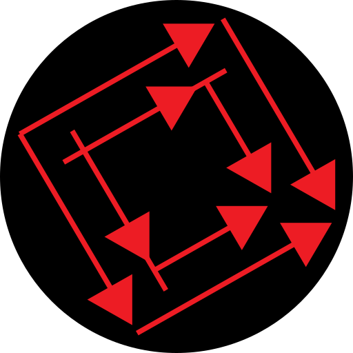

# cmpctircd
*compact eye-are-see-dee*  
An [IRC](https://simple.wikipedia.org/wiki/Internet_Relay_Chat) server software; written with modern tools.

Under heavy development. It'll be clear when it is production ready.

## Contact
Feel free to report any bugs as an [issue](https://github.com/cmpct/cmpctircd/issues).

We run a live server at [irc://irc.cmpct.info:+6697/stratcom](irc://irc.cmpct.info:+6697/stratcom), come and join us!

## Quickstart
### Dependencies
* .NET Core 5.0

### Clone and run
```
git clone https://github.com/cmpct/cmpctircd

cd cmpctircd/cmpctircd

# Fetch dependencies
dotnet restore

# Adjust App.config to suit your preferences
dotnet run
```

### Docker container
```
wget https://raw.githubusercontent.com/cmpct/cmpctircd/master/Dockerfile

mkdir cmpctircd-docker
# Place your App.config and so on in cmpctircd-docker

# Your cmpctircd-docker folder will be populated with logs once the IRCd runs
docker build -t cmpctircd .
docker run -v $HOME/cmpctircd-docker:/cmpctircd/ --name cmpctircd -p 6667:6667 -p 6697:6697 -d cmpctircd
```

## Contributing
Many hands make light work, we welcome you to help us out.

Before you start working, check in on the project's [issues](https://github.com/cmpct/cmpctircd/issues) and discuss your plans in order to avoid repeated or unnecessary work.

### Workflow
If you're new here, we recommend that you [create a fork](https://docs.github.com/en/github/getting-started-with-github/quickstart/fork-a-repo) of the project in order to commit your changes to it. After creating a fork, you can clone the repository from your own account:
```
# Clone the repository from your own account
git clone https://github.com/<YOUR_USERNAME>/cmpctircd cmpctircd
```
It is also recommended that you add the main repository as a remote, so that you can keep up to date with the project:
```
# Add the main repository as "upstream"
git remote add upstream https://github.com/cmpct/cmpctircd cmpctircd

# Pull from the upstream repository
git pull upstream master
```

You must make your changes in a **[new branch](https://git-scm.com/book/en/v2/Git-Branching-Basic-Branching-and-Merging) with a name related to the task** you are performing:
```
# Create a new branch for your task
git checkout -b feature/17-Implement-LIST
```
Branches are usually **prefixed with the corresponding task type**, such as *bugfix* or *feature*, as above.

Please follow the below convention for commit messages:
```
<component>: <description>

<remarks>

<task type>: #<task number>
```
For example:
```
Handlers: Add LIST command handler.

New users will now be able to find a channel to join.

feature: #17
```

When you are finished making your changes, push them to your remote repository and [create a pull request](https://docs.github.com/en/github/collaborating-with-issues-and-pull-requests/proposing-changes-to-your-work-with-pull-requests/creating-a-pull-request) for us to review.

### Tests
This project uses NUnit for testing. Tests are located in the `cmpctircd-tests` folder.

Please run the tests **before and after** making changes, to make sure you have not broken anything before submitting your pull request:

```
# Run all tests
dotnet tests
```
If you are adding a feature, please write tests for the feature's components. If you are writing a bugfix, where possible, please write a regression test for it.

---

a prjct by frnds @ [cmpct](https://cmpct.info/).